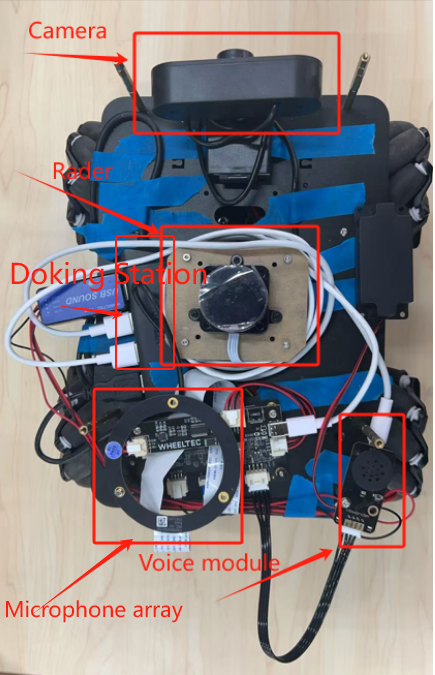
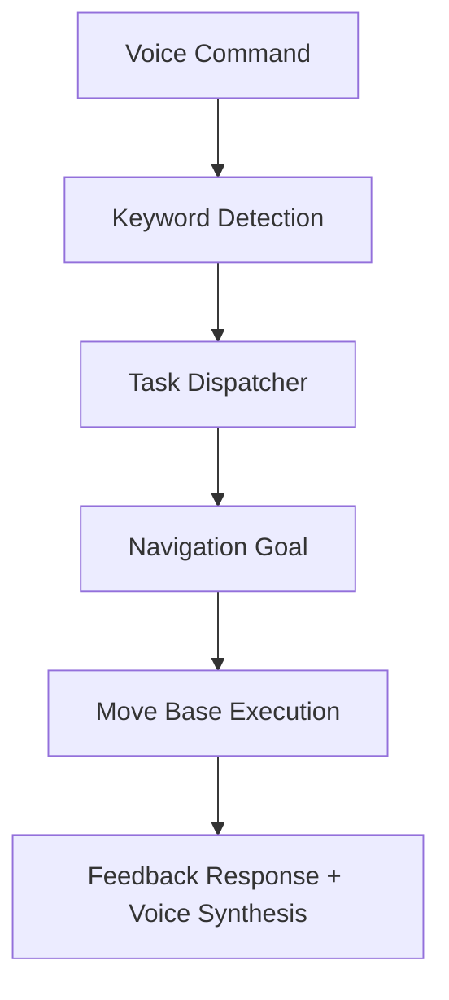

# Coffee Delivery Robot ☕🤖

The Coffee Delivery Robot is designed to assist beverage bars with delivering drinks within the same floor of the laboratory, thereby solving the problem of understaffing in beverage stores. As a mobile robot platform, it integrates map-building navigation, radar following, obstacle avoidance, voice control and human–machine interaction.

---

## 📦 Project Structure
<div align="center">
  
</div>
---

### 🛠️ Hardware Components

The coffee delivery robot is built on a modular and stable hardware platform designed for indoor navigation and voice interaction. The main components are as follows:

#### 🔧 Chassis & Power 

- **Base Platform**: TARK R20 mobile chassis
- **Wheels**: Four Mecanum wheels for omnidirectional movement
- **Battery**: Rechargeable lithium battery mounted at the rear for full-system power supply

#### 🧠 Core Computing Unit

- **Main Board**: NVIDIA Jetson Nano TX1
- **Operating System**: Ubuntu 18.04 with ROS1 Melodic
- **Motor Controller**: OpenCTR controller for low-level motor control and odometry

#### 🧩 Sensor and I/O Modules (from front to back on the second layer)

- **Camera**: RGB USB camera for visual input and potential object detection
- **LiDAR**: LD19 360° laser scanner for obstacle detection and SLAM
- **Microphone Array**: For voice recognition and sound direction localization
- **Voice Module**: Provides speech synthesis and voice command processing
- **USB Expansion**: USB hub fixed on the left side for peripheral connection

#### ☕ Payload Section

- **Top Shelf**: Custom cargo deck with slots to securely hold up to four coffee cups

---

#### 📷 Robot Overview Photo

_(Insert a labeled photo or diagram of the robot here for visual reference)_


### 🧠 Software Architecture

This robot system is built on **ROS1 Melodic** and runs on **Jetson Nano TX1** with Ubuntu 18.04. The software is modular and structured into several functional ROS packages in the workspace:

```bash
catkin_ws/src/
├── tarkbot_bringup        # Launch scripts to start base, LiDAR, and camera drivers
├── tarkbot_calibrate      # Tools and scripts for sensor and motion calibration
├── tarkbot_description    # URDF and robot model files (for visualization and simulation)
├── tarkbot_doc            # Project documentation, development logs, and debugging notes
├── tarkbot_nav            # Autonomous navigation using move_base and costmap
├── tarkbot_package        # Sensor SDKs and utilities (joystick, camera, lidar filters, web control)
├── tarkbot_robot          # Low-level control code for the chassis (openctr driver)
├── tarkbot_slam           # SLAM packages (e.g., GMapping or Hector SLAM for mapping)
├── tarkbot_teleop         # Manual control using keyboard or joystick
├── tarkbot_voice          # Voice recognition and synthesis for voice control
├── simple_follower        # LiDAR-based person/object following behavior
```

Each package is responsible for a distinct subsystem:

- **Bringup & Control**: `tarkbot_bringup`, `tarkbot_robot`
- **Model & Calibration**: `tarkbot_description`, `tarkbot_calibrate`
- **Perception & SLAM**: `tarkbot_slam`, `tarkbot_package`, `simple_follower`
- **Navigation & Autonomy**: `tarkbot_nav`
- **Teleoperation & Voice**: `tarkbot_teleop`, `tarkbot_voice`
- **Documentation**: `tarkbot_doc`

The system is launched using dedicated `launch` files under each relevant package. Core topics and services are managed through ROS communication (topics, services, and TF tree), with parameter tuning and sensor drivers customized for this robot platform.


### 📡 Communication

The coffee delivery robot relies on multiple hardware interfaces and network configurations to ensure reliable sensor integration and remote control.

#### 🔌 USB Serial Interface Mapping

All major components are connected via USB and mapped to specific device ports on the Jetson Nano:

| Component        | Port             |
|------------------|------------------|
| Motion Chassis (OpenCTR) | `/dev/ttyACM0` |
| Voice Module     | `/dev/ttyACM1`   |
| LiDAR (LD19)     | `/dev/ttyUSB0`   |

These serial ports are accessed by ROS nodes for real-time data communication and control.

#### 🌐 Network Architecture for Remote Operation

To facilitate remote monitoring and control, we use a virtual machine (VM) configured with Ubuntu 18.04 and ROS1 Melodic. The VM connects to the robot through SSH over different network configurations depending on the task:

- **Mapping (Campus Network - NAT Mode)**  
  Mapping requires wide area network access to build large-scale maps. The virtual machine uses NAT mode and connects to the robot's Jetson Nano via SSH. This allows access to external networks while still maintaining connectivity to the robot.

- **Navigation (Lab WiFi - Bridge Mode)**  
  Navigation relies on stable, low-latency bidirectional communication between the VM and the robot. We use bridge mode and configure static IPs to ensure reliable feedback during goal navigation.

#### 🌐 ROS Networking Configuration

Examples of `.bashrc` configuration on both devices are provided below:

- **Mapping (NAT mode)**

VM:
```bash
export ROS_HOSTNAME=192.168.73.137
export ROS_MASTER_URI=http://10.169.2.110:11311
```
Jetson Nano:
```bash
export ROS_HOSTNAME=10.169.2.110
export ROS_MASTER_URI=http://10.169.2.110:11311
```
- **Navigation (Bridge mode)**
VM:
```bash
export ROS_HOSTNAME=192.168.110.145 
export ROS_MASTER_URI=http://192.168.110.224:11311
```
Jetson Nano:
```bash
export ROS_HOSTNAME=192.168.110.224
export ROS_MASTER_URI=http://192.168.110.224:11311
```
🧠 Why use different networks?
```bash
Mapping benefits from a broader coverage area enabled by the campus network, while navigation requires reliable feedback and action communication. Therefore, a stable local WiFi (with static IPs) ensures the success of ROS action-based navigation.
```
---

## 📘 Theoretical Manual

This section provides a high-level explanation of the key algorithms and principles that enable the coffee delivery robot's core functionalities.

---

### 1. Robot Mapping and Localization

The robot supports two simultaneous localization and mapping (SLAM) approaches:

#### 🗺️ Gmapping
- Based on the **Rao-Blackwellized Particle Filter**.
- Efficient for small-scale environments and rapid prototyping.
- **Limitation**: Performs poorly in the presence of transparent surfaces (e.g., glass doors), as laser scans may pass through them and misclassify open space.

#### 🗺️ Cartographer
- Developed by Google, using **real-time loop closure detection** and **scan matching**.
- More robust in complex indoor environments such as the lab.
- Better handling of **glass doors**, walls, and ambiguous boundaries.
- Recommended for production-grade mapping in this robot.

#### 🧾 Map Storage
- Uses ROS `map_server` package to **store and serve maps** for use in navigation.
- Maps are saved as `.pgm` and `.yaml` files for further use with AMCL.

---

### 2. Robot Navigation

#### 📌 Localization
- Uses **AMCL** (Adaptive Monte Carlo Localization) for probabilistic pose estimation.
- Relies on 2D LiDAR scan-matching against the known map for global localization.
- Continuously updates robot pose based on incoming scan and odometry data.

#### 🧭 Path Planning
- Employs the `move_base` package:
  - **Global Planner**: plans a path from start to goal using costmaps.
  - **Local Planner**: generates velocity commands to avoid obstacles in real time.
- Navigation goals can be issued through **RViz GUI** or via **voice command** interface.

---

### 3. Voice Interaction System

#### 🗣️ Speech Recognition
- Implements **keyword spotting** to extract intent from user commands.
- Listens for predefined phrases such as "deliver coffee", "start mapping", etc.

#### 🔊 Speech Synthesis
- Robot replies with appropriate **synthesized voice responses** based on internal state.
- Example: “Heading to Station 2 to deliver coffee.”

#### 🧠 Integration
- Keyword recognition triggers corresponding ROS actions or services.
- The voice system is tightly coupled with navigation and task execution.

---

### 4. Simple laser follow and warning

#### 🧲 Laser-based Following
- Utilizes LD19 360° LiDAR to detect dynamic targets in front of the robot within a configurable range (e.g., 0.5–2.5 meters).
- Continuously identifies the closest moving cluster using scan segmentation and centroid tracking.
- Adjusts robot velocity commands (/cmd_vel) via proportional control based on target displacement in LiDAR frame.

#### 🎯 Sound-source Positioning
- Microphone array captures spatial audio cues to estimate direction of arrival (DOA) of human voice.
- Voice angle estimation is fused with LiDAR data to direct robot rotation toward speaker.
- When keyword is detected via voice system, robot initiates turn-to-source behavior.

### 5. System Integration (Overall Logic)

- The robot operates under multiple **modular subsystems**:
  - Voice → triggers tasks
  - Navigation → handles execution
  - Sensors → provide environment feedback
- Each subsystem is orchestrated using ROS topics, services, or actions.


---

## 🚀 User Guide

### 1. Prerequisites

- Ubuntu [18.04] with ROS1 [melodic]
- ROS Dependencies
```bash
ros-$ROS_MELODIC-gmapping ros-$ROS_MELODIC-cartographer-ros ros-$ROS_MELODIC-robot-localization ros-$ROS_MELODIC-move-base ros-$ROS_MELODIC-amcl ros-$ROS_MELODIC-map-server ros-$ROS_MELODIC-teleop-twist-keyboard ros-$ROS_MELODIC-joy ros-$ROS_MELODIC-usb-cam ros-$ROS_MELODIC-pocketsphinx ros-$ROS_MELODIC-rosserial ros-$ROS_MELODIC-audio-common ros-$ROS_MELODIC-sound-play ros-$ROS_MELODIC-rosbridge-suite
```
- List of required packages or dependencies
```bash
# ROS-Python bindings
rospkg==1.3.0 catkin_pkg==0.4.20 pyyaml==5.4.1

# Laser data processing and visualization
numpy==1.19.5 scipy==1.5.4 matplotlib==3.3.4

# Kalman filtering / Sensor Fusion
filterpy==1.4.5 pyquaternion==0.9.9

# Speech Recognition
SpeechRecognition==3.8.1 pyaudio==0.2.11

# Text-to-Speech (TTS)
pyttsx3==2.90 gTTS==2.2.3

# Sound localization / Microphone array (if custom processing)
sounddevice==0.4.4 librosa==0.8.1

# Network / Remote connection
paramiko==2.10.4 netifaces==0.10.9

# Optional: visualization tools for debugging
opencv-python==4.5.1.48
```

## 🖥️ System Setup
### 1. Network Configuration
- Ensure that both the Jetson Nano and your host computer are connected to the same local network (LAN). You can achieve this by connecting both devices to the same Wi-Fi or wired network.

### 2. SSH Access
After connecting both devices to the same network, establish an SSH connection from your host computer to the Jetson Nano. Open a terminal on your host computer and run:

```bash
ssh username@<Jetson_Nano_IP_address>
```
Replace <Jetson_Nano_IP_address> with the actual IP address of the Jetson Nano.

### Navigate to ROS Workspace
- Once connected via SSH, navigate to the ROS workspace directory where your project is located:

```bash
cd Coffee_delivery_nano/ros_ws/src
```
## 🚀 Running the Robot
### 1. Launch the Required Nodes
To start the robot and enable voice control, you need to launch several ROS nodes. Run the following commands to start the necessary services:

- Initialize the voice recognition system:

```bash
roslaunch xf_mic_asr_offline base.launch
```

- Initialize the microphone and voice processing:
```bash
roslaunch xf_mic_asr_offline mic_init.launch
```

- Start the main robot control and navigation system:
```bash
roslaunch xf_mic_asr_offline tarkbot_base_node voi_navigation.launch
```
### 2. Voice Control
Once the above nodes are running, the robot will be ready to receive voice commands. You can issue commands to control the robot, such as delivering coffee to a specific location.

Example commands include:
- "Deliver coffee to Station 1."
- "Navigate to Station 2."
- "Stop the robot."

The system uses speech recognition and will respond via synthesized speech.

## ⚙️ Troubleshooting & Tips
### No Response from Robot:
```bash
Ensure that the SSH connection is stable and that the ROS nodes are correctly launched. You may also check for any network-related issues if the robot is not responding to voice commands.
```
### Voice Command Not Recognized:
```bash
Make sure you are using the predefined voice commands. The system is currently configured to recognize specific phrases (e.g., "deliver coffee," "stop robot"). Ensure that the microphone is properly connected and functioning.
```
### Robot Not Moving:
```bash
Verify the robot's motors and sensors are correctly connected. You may check the robot's status and logs by monitoring the terminal output where the ROS nodes were launched.
```

